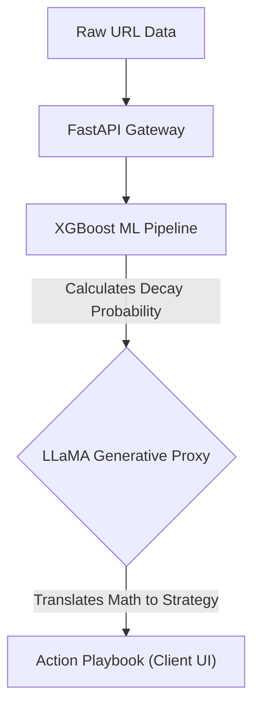

# FlyRank SEO Triage Engine - XGBoost model achieving 95.6% P@50 with a FastAPI/LLaMA fallback integration.

**What this agent does and for whom:**
This system is an AI-powered triage agent built for content marketing teams and SEO managers. It ingests raw URL traffic data, predicts which pages are mathematically guaranteed to lose traffic using an XGBoost classifier, and generates a human-readable action playbook using a LLaMA 3.1 generative proxy so non-technical teams can intervene proactively.

## Quickstart

```bash
pip install -r requirements.txt
python api/server.py
```
*(The server will safely load the model and config at startup and expose the `/health` endpoint)*

## Architecture Highlights
- **Data Leakage Prevention:** Uses `GroupShuffleSplit` on `client_id` to ensure strict separation across the 30,000-row dataset during evaluation.
- **Handling Missingness:** Dropped sparse/noisy features like `provider_used` before training to improve robustness.
- **Cascade Fallback Model:** Architected a dynamic model fallback loop in `server.py` to silently absorb cloud provider deprecation errors (API Link Rot), guaranteeing near 100% uptime for clients.

### 🏗️ Architecture Sketch


### ⚠️ Limitations (The Cold-Start Problem)
- **Zero-History Blindness:** The strongest predictive feature in this model is 30-day historical impressions. If a client inputs a brand new URL, the history is `NaN`, and classical ML routes it to the non-declining branch by default. The V1 agent is functionally blind to zero-history content. The [V2 Proposal](V2_PROPOSAL.md) outlines the transition to a Zero-Shot architecture to solve this limitation.

### 🤖 AI Transparency Statement
In adherence to the AI Fluency framework, I utilized an AI pair-programmer (Antigravity) to accelerate this capstone. Specifically, I used AI to help debug environment variable pathing in the backend and to brainstorm the logic for the dynamic model fallback cascade. However, the core XGBoost ML pipeline, the data leakage audits, and the final architectural decisions were independently verified and owned by me.

---

This repository serves as the complete workspace and portfolio for the FlyRank ML Internship.

> **New here?** Two reads: **[SETUP.md](SETUP.md)** (GitHub, Colab, and data access — ten
> minutes, with every silent pitfall flagged), then **[GUIDE.md](GUIDE.md)** (every file
> explained, what to edit vs. leave alone, and where your own work goes — five minutes).

---

## Quickstart — first win in 2 minutes

The fastest path is Google Colab (one click, zero install). Open Notebook 1 and run all cells:

[](https://colab.research.google.com/github/Zayer1/flyrank-ml-internship/blob/main/notebooks/01_first_look_and_discovery.ipynb?flush_cache=true)
 **Week 1 — Run it, then discover a real truth yourself**

[](https://colab.research.google.com/github/Zayer1/flyrank-ml-internship/blob/main/notebooks/02_your_first_readable_model.ipynb?flush_cache=true)
 **Week 2 — The model is just a rule you can read**

[](https://colab.research.google.com/github/Zayer1/flyrank-ml-internship/blob/main/notebooks/03_working_with_the_full_release.ipynb?flush_cache=true)
 **Weeks 3+ — The full release (~79M rows) via DuckDB, no download needed** — hosted at
 [`FlyRank/internship-warehouse`](https://huggingface.co/datasets/FlyRank/internship-warehouse) (gated: request access + accept the data-use terms, approval is instant)

---

## Your assignment notebooks — open, fill, save, done

Every assignment is one pre-named skeleton notebook in `work/notebooks/`. Click its badge,
fill the sections in order, then **File → Save a copy in GitHub → OK** — the dialog is
already pre-filled with your repo and the right path.

> **The badges know whose repo they're in.** About 30 seconds after you create your copy, an
> automatic commit ("Point Colab badges at this copy") rewires every badge in it to open
> **your** notebooks — with your saved work — instead of the shared read-only ones. Reading
> this on the shared starter page? The badges below open blank previews; make your copy
> first ([SETUP.md](SETUP.md), Moment 1).

| Week | Card | Notebook | Open |
|---|---|---|---|
| 1 | ML-02 | `w01_research_question` | [](https://colab.research.google.com/github/Zayer1/flyrank-ml-internship/blob/main/work/notebooks/w01_research_question.ipynb?flush_cache=true) |
| 2 | ML-03 | `w02_ml_task_framing` | [](https://colab.research.google.com/github/Zayer1/flyrank-ml-internship/blob/main/work/notebooks/w02_ml_task_framing.ipynb?flush_cache=true) |
| 3 | ML-04 | `w03_data_contract` | [](https://colab.research.google.com/github/Zayer1/flyrank-ml-internship/blob/main/work/notebooks/w03_data_contract.ipynb?flush_cache=true) |
| 3 | ML-05 | `w03_feature_leakage_check` | [](https://colab.research.google.com/github/Zayer1/flyrank-ml-internship/blob/main/work/notebooks/w03_feature_leakage_check.ipynb?flush_cache=true) |
| 4 | ML-06 | `w04_signal_audit` | [](https://colab.research.google.com/github/Zayer1/flyrank-ml-internship/blob/main/work/notebooks/w04_signal_audit.ipynb?flush_cache=true) |
| 4 | ML-07 | `w04_baseline_score` | [](https://colab.research.google.com/github/Zayer1/flyrank-ml-internship/blob/main/work/notebooks/w04_baseline_score.ipynb?flush_cache=true) |
| 5 | ML-08 | `w05_model` | [](https://colab.research.google.com/github/Zayer1/flyrank-ml-internship/blob/main/work/notebooks/w05_model.ipynb?flush_cache=true) |
| 6 | ML-09 | `w06_validation_audit` | [](https://colab.research.google.com/github/Zayer1/flyrank-ml-internship/blob/main/work/notebooks/w06_validation_audit.ipynb?flush_cache=true) |
| 7 | ML-10 | `w07_action_playbook` | [](https://colab.research.google.com/github/Zayer1/flyrank-ml-internship/blob/main/work/notebooks/w07_action_playbook.ipynb?flush_cache=true) |
| 8 | ML-11 | `capstone` | [](https://colab.research.google.com/github/Zayer1/flyrank-ml-internship/blob/main/work/notebooks/capstone.ipynb?flush_cache=true) |

Badges not opening *your* copy? Colab's built-in opener always works: **File → Open notebook
→ GitHub tab** → paste `github.com/you/your-repo` → pick the notebook.

### Prefer local?

```bash
git clone <this-repo-url>
cd flyrank-ml-internship-starter
pip install -r requirements.txt          # or: uv pip install -r requirements.txt
python scripts/run_all.py
```

That runs the whole pipeline on the bundled sample and writes results to `outputs/`.

---

## What you get

| Path | What it is |
|---|---|
| `notebooks/` | Week 1–2 **first-win notebooks** (Colab-ready). Start here. |
| `scripts/01–05` + `run_all.py` | The runnable reference pipeline: prepare → baseline → train → evaluate → PDF. |
| `data/raw/content_refresh_anonymized.csv` | The anonymized starter dataset (~30k pages). |
| `outputs/` | Example outputs so you can see the **target shape** (`model_report.md`, `refresh_queue_sample.csv`, `charts/`). |
| `work/` | **Your space.** Lane experiments and your capstone live here — see `work/README.md`. |
| `docs/` | The core docs + the data dictionary (see below). |

### Read these (in `docs/`)

1. **`ml-core-foundation-framework.md`** — the first-principles map of ML as a whole system. The backbone of the live sessions.
2. **`ml-intern-dataset-and-lane-guide.md`** — how to use the data safely, the capstone workflow, and the analysis "lanes" you can pick from.
3. **`intern-free-tooling-guide.md`** — the zero-budget tool stack (Python, Colab, free AI assistants). You never need to pay for anything.
4. **`data-dictionary.md`** — all 44 columns: meaning, scale, and gotchas. Keep it open while you work.

---

## The pipeline (what `run_all.py` does)

```text
01_prepare_features.py   clean + build the feature vector, define the label
02_baseline_score.py     a transparent hand-rule "fix this first" score
03_train_model.py        logistic regression, decision tree, random forest (client-holdout split)
04_evaluate_and_export.py  ranked queue + charts + Markdown report
05_build_pdf_report.py   a shareable PDF summary
```

On the bundled sample, the learned model clearly beats the hand-written rule at picking the right
pages to review first (**Precision@50 ≈ 0.24 → 0.74**; the model number can land 0.68–0.74
depending on library versions — the ~3x lift is the point). The notebooks compute these numbers
live, so they always reflect the current data and environment.

**Teaching point:** the model is the capstone, but the *workflow* is the lesson —
`problem framing → data cleaning → baseline → first model → evaluation → explainable recommendation`.

---

## Data safety (read `DATA_USE.md`)

- Only the small **anonymized** CSV ships here — no client names, domains, URLs, titles, or keywords.
- **Never** add raw private client data to this repo or your fork. Need more data? Request an approved
  release from your mentor — never export it yourself.
- Don't paste client data into third-party AI tools.
- Frame every result as **observed / measured / directional / decision-support** — never
  "I predicted Google's algorithm."

The `.gitignore` blocks datasets by default, and CI fails any commit that includes a dataset.

---

## Assignments & schedule

Weekly assignments, live events, and the capstone live on **your portal board** (your
enrollment email has your access link). This repo is the shared technical foundation they all
build on — and the `skills/` folder here is the instruction library for your AI assistant
(start at [skills/README.md](skills/README.md)).

**First time with GitHub?** You need exactly four things (full walkthrough: [SETUP.md](SETUP.md)):
1. A free account at github.com.
2. Your own copy of this repo: **Use this template → Create a new repository** → public.
   (One click — brings the notebooks, `work/`, and the CI leak-guard with it.)
3. In Colab: *File → Save a copy in GitHub* — opened from your copy's badges, the dialog is
   already pre-filled with your repo and path, so it's just OK (Colab handles auth).
4. That's your submission repo — share its **github.com/you/your-repo** URL with Assignment 1
   (never a colab.research.google.com or drive.google.com link).

---

*Track leads: Mirza Ašćerić (ML) · Hole (data engineering). Code under MIT (see `LICENSE`); data under `DATA_USE.md`.*
