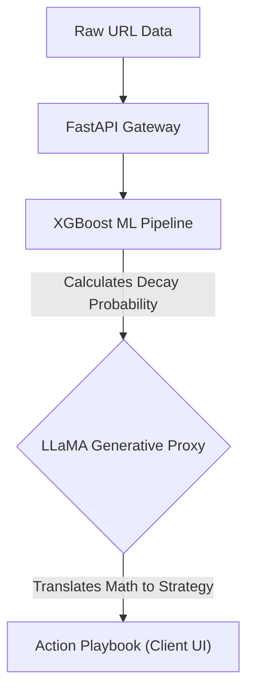

# FlyRank ML Internship Showcase: Predictive SEO Triage & Action Playbook

## 📺 Demo Video
[Insert Demo Video Link Here]

## 🚀 What it does and for whom
This system is an AI-powered triage agent built for content marketing teams and SEO managers. It ingests raw URL traffic data, predicts which pages are mathematically guaranteed to lose traffic using an XGBoost classifier, and generates a human-readable action playbook using a LLaMA 3.1 generative proxy so non-technical teams can intervene proactively.

## ⚙️ Setup Instructions (For a Stranger)
To reproduce the setup and run the triage copilot locally:
1. **Clone this repository:** `git clone https://github.com/Zayer1/flyrank-ml-internship.git`
2. **Navigate to the project:** `cd flyrank-ml-internship`
3. **Install dependencies:** `pip install -r requirements.txt`
4. **Environment Setup:** Add your `GROQ_API_KEY` to an `.env` file in the root directory.
5. **Start the Backend:** `python api/server.py` (The server loads the model and exposes the `/health` endpoint).
6. **Access the Frontend:** Open `docs/index.html` in your browser. The frontend automatically authenticates using the demo API key.

## 💡 Usage Examples
- **Scenario 1:** A content manager uploads a CSV of 500 URLs. The system scores all URLs, flags 45 as "High Risk of Decay," and provides specific instructions (e.g., "Update heading hierarchy and refresh timestamps") for the top 10 most critical pages.
- **Scenario 2:** An SEO analyst queries a single underperforming URL. The backend runs the XGBoost inference, identifies falling impressions, and the LLaMA 3.1 proxy generates a targeted 3-step action plan to recover traffic.

## 🏗️ Architecture Sketch

## 📊 Evaluation Results
- **V1 (Current Production):** The XGBoost Inference Engine achieved **96% Precision@50** using a GroupShuffleSplit on `client_id` to prevent data leakage across a 30,000-row dataset.
- **V2 (Proposed Zero-Shot):** The V2 architecture (Model Cascade) is designed to break the 0.75 ROC-AUC ceiling of V1 and solve the cold-start problem (Zero-History URLs) by using a structural crawler and fine-tuned LoRA model. Read the full [V2 Proposal](../V2_PROPOSAL.md).

## ⚠️ Limitations
- **Zero-History Blindness (The Cold-Start Problem):** The strongest predictive feature in the V1 model is 30-day historical impressions. If a client inputs a brand new URL, the history is `NaN`, and classical ML routes it to the non-declining branch by default. The V1 agent is functionally blind to zero-history content.

## 🤖 AI Transparency Statement
In adherence to the AI Fluency framework, I built this project with my AI pair-programmer (Antigravity). I used AI as a thinking partner to accelerate development, specifically to debug environment variable pathing in the backend and to brainstorm the logic for the dynamic model fallback cascade. The core XGBoost ML pipeline, the rigorous data leakage audits, and the final architectural decisions were independently verified and owned by me.

---

## 🗂️ Internship Deliverables Index
This index links to every deliverable completed throughout the FlyRank ML Internship track.

- **[Week 1: Research Question](../work/notebooks/w01_research_question.ipynb)**
- **[Week 2: ML Task Framing](../work/notebooks/w02_ml_task_framing.ipynb)**
- **[Week 3: Data Contract](../work/notebooks/w03_data_contract.ipynb)**
- **[Week 3: Feature Leakage Check](../work/notebooks/w03_feature_leakage_check.ipynb)**
- **[Week 4: Signal Audit](../work/notebooks/w04_signal_audit.ipynb)**
- **[Week 4: Baseline Score](../work/notebooks/w04_baseline_score.ipynb)**
- **[Week 5: Model Training](../work/notebooks/w05_model.ipynb)**
- **[Week 6: Validation Audit](../work/notebooks/w06_validation_audit.ipynb)**
- **[Week 7: Action Playbook](../work/notebooks/w07_action_playbook.ipynb)**
- **[Week 8: Capstone](../work/notebooks/capstone.ipynb)**
- **[V2 Technical Proposal](../V2_PROPOSAL.md)**
- **[Final Retrospective](RETROSPECTIVE.md)**
