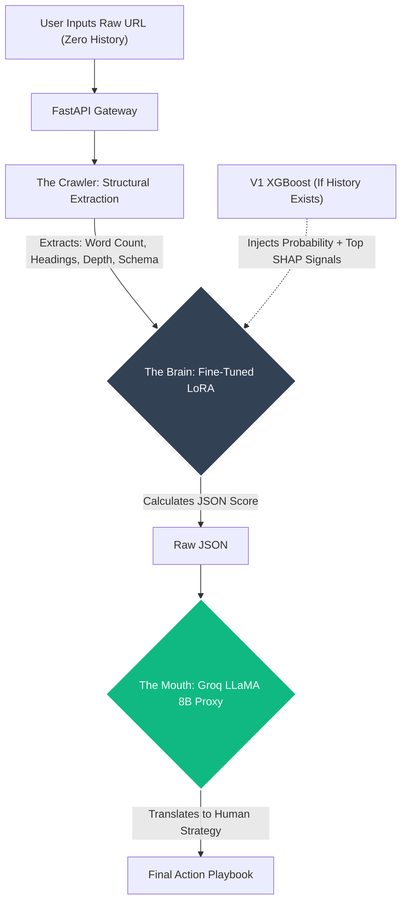

# Technical Proposal: FlyRank V2 (Zero-Shot Predictive Architecture)

## Executive Summary
The current FlyRank V1 ML pipeline successfully implements a highly optimized XGBoost ensemble to predict SEO decay, achieving 96% Precision@50 on grouped test sets. However, a rigorous post-mortem reveals structural limitations in V1 that cap its ceiling and prevent it from evaluating brand-new URLs.

This proposal outlines the architecture for **FlyRank V2**, transitioning to a **Model Cascade Deep Learning Architecture**. V2 solves the V1 cold-start problem by introducing a structural web crawler and a fine-tuned LoRA model, capable of **Zero-Shot Inference** for URLs with no historical data.

---

## 1. V1 Post-Mortem: Why Classical ML Has Hit a Ceiling
Before proposing V2, it is critical to acknowledge the mathematical limitations of the V1 build:
1. **The Cold-Start Blindness:** The #1 feature in V1 is `impressions_prev_30d` (22.2% importance). If a user inputs a brand new URL, this is `NaN`. XGBoost routes this missing value to the non-declining branch by construction. V1 is fundamentally incapable of evaluating zero-history content.
2. **The Bayes Error Floor:** V1 achieved a ROC-AUC of 0.7508. This is not a tuning failure, but the theoretical ceiling of the proxy label (`trend_pct < -20%`), which carries ~15-25% generative noise from seasonality and viral spikes. 

V2 is designed specifically to solve the Cold-Start problem, while laying the groundwork to solve the proxy label noise in partnership with the senior ML team.

## 2. Proposed Architecture: The Model Cascade
To achieve Zero-Shot prediction, V2 decouples feature extraction, heavy semantic scoring, and natural language generation into a highly efficient pipeline.

### Step 1: The Crawler (The Cold-Start Fix)
For URLs with no Google Search Console data, the Gateway utilizes a Managed Extraction API (e.g., Firecrawl) to instantly crawl the live URL. This outsources the heavy web-scraping infrastructure and returns a clean payload containing:
1. **Structural Metadata:** For calculating proxies like `word_count`, `heading_hierarchy`, and `schema_markup`.
2. **Semantic Text:** The raw, cleaned markdown of the article's actual content.

### Step 2: The "Brain" (Specialized Heavy Inference)
A heavy open-weights model (e.g., LLaMA-3 70B) fine-tuned using **LoRA (Low-Rank Adaptation)**. 
- **The Zero-History Input:** The LoRA prompt is injected with BOTH the structural metrics AND the semantic text. This prevents the model from learning a flawed "longer = better" heuristic by forcing it to evaluate structural density against actual semantic quality.
- **The V1 Handshake:** If the URL *does* have historical data, V1 is still used. Instead of injecting raw tree-leaf vectors (which lack semantic meaning to an LLM), we inject V1's `predict_proba` and top SHAP feature importances as text context.
- **Output:** Outputs a strict, deterministic JSON object containing calculated opportunity/risk scores.

### Step 3: The "Mouth" (High-Speed Proxy)
The raw JSON output from the Brain is passed to an ultra-fast API proxy (e.g., **Groq LLaMA 8B**), which translates the math into a conversational Action Playbook in milliseconds.

## 3. Business Impact & Unit Economics
1. **Frictionless Onboarding:** Users no longer need to connect Google Search Console or upload heavy CSVs to get immediate value. They drop a raw URL, and the crawler + cascade evaluates it instantly.
2. **Cost Optimization:** Decoupling the Heavy Inference (Brain) from Generation (Mouth) slashes GPU costs. Evaluating a standard URL costs roughly **$0.0025 per inference**.
3. **Expanding TAM & PLG:** V2 opens the market to solo creators and startups lacking historical data, enabling a highly lucrative "Free Trial" tier to lower CAC.

## 4. Open Technical Questions (For Senior Engineering Review)
To move this from proposal to production, I would look to collaborate with the FlyRank ML team on two specific fronts:
1. **Time-Series Ground Truth:** Moving away from the 30-day proxy label to a true future-window outcome using the 79M row warehouse to break the 0.75 ROC-AUC ceiling.
2. **Crawler Infrastructure:** Defining the specific structural features (e.g., keyword density vs. semantic distance) the crawler should pass to the LoRA Brain.

---
*Prepared by Zayer — Submitted alongside the FlyRank V1 Capstone.*
