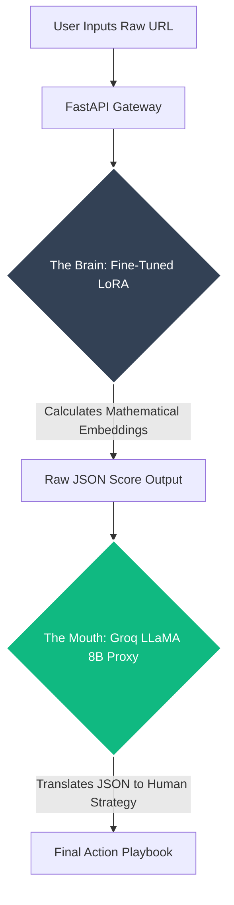

# Technical Proposal: FlyRank V2 (Zero-Shot Predictive Architecture)

## Executive Summary
The current FlyRank V1 ML pipeline successfully implements a highly optimized XGBoost ensemble to predict SEO decay. While highly precise (optimized for Precision@50), it is fundamentally constrained by the limitations of classical Machine Learning: it requires historical, tabular CSV data (clicks, impressions, ctr) to operate.

This proposal outlines the architecture for **FlyRank V2**, transitioning from classical ML to a **Model Cascade Deep Learning Architecture**. This V2 system would be capable of **Zero-Shot Inference**—allowing users to input a raw URL with zero historical data, while the system dynamically estimates virality, structural integrity, and SEO decay risk.

---

## 1. The Core Limitation of V1
Classical tree-based models (XGBoost/LightGBM) operate purely as mathematical pattern matchers on historical tabular data. 
- **The Bottleneck:** If a user writes a completely new post (e.g., `zayermorning.com/new-article`) with zero historical search console data, V1 cannot evaluate it. It is blind without the CSV.

## 2. Proposed Architecture: The Model Cascade
To achieve Zero-Shot prediction, we must transition to a specialized Deep Learning pipeline that possesses an internal semantic "world model" of language, SEO, and structural patterns. To optimize for cost and speed, V2 will utilize a **Router / Cascade** pipeline.

### Step 1: The "Brain" (Specialized Heavy Inference)
Instead of a generalist LLM, we fine-tune a heavy open-weights model (e.g., LLaMA-3 70B or equivalent) using **LoRA (Low-Rank Adaptation)**. 
- The model is fine-tuned strictly on SEO performance datasets. 
- **Ensemble Embeddings:** To maximize accuracy, the mathematical tree-leaf outputs (vectors) from the V1 XGBoost model can be fed directly into the Deep Learning prompt context, giving the neural network a pre-processed mathematical head start.
- **Output:** The model does not generate conversational text. It outputs a strict, deterministic JSON object containing calculated scores (e.g., `{"virality_potential": 8.5, "refresh_required": false}`).

### Step 2: The "Mouth" (High-Speed Proxy)
Running a heavy LoRA model for conversational output is an inefficient use of GPU cycles.
- The raw JSON output from Step 1 is passed to an ultra-fast, low-cost API proxy (e.g., **Groq** using a smaller 8B model).
- The Groq proxy translates the raw mathematical JSON into a conversational, human-readable Action Playbook for the end user in milliseconds.

## 3. Business Impact
1. **Frictionless Onboarding:** Users no longer need to connect Google Search Console or upload heavy CSVs to get immediate value. They drop a raw URL into the UI, and the system evaluates it instantly.
2. **Cost Optimization & Unit Economics:** By decoupling the Heavy Inference (Brain) from the Conversational Generation (Mouth), GPU costs are slashed by up to 90% per request compared to using a unified heavy LLM. 
   - *Cost Estimate:* Assuming a LoRA adapter hosted on serverless infrastructure (~$1.20/1M tokens) and a Groq LLaMA 8B proxy (~$0.05/1M tokens), evaluating a standard 2,000-token URL would cost roughly **$0.0025 per inference**. This allows for massive scale while maintaining highly lucrative gross margins.
3. **Expanding Total Addressable Market (TAM):** V1 serves enterprise clients with established datasets. V2 opens the market to small firms, solo creators, and startups who lack historical CSV data or data science teams, massively expanding the client base.
4. **Product-Led Growth (Freemium Acquisition):** Because the V2 unit economics run at fractions of a cent per inference, it unlocks the financial viability of a "Free Trial" tier. Users can test the product on a single URL for free, lowering customer acquisition costs (CAC) and driving organic conversion to the $1,499/month tier.
5. **Proprietary Moat:** The fine-tuned LoRA weights combined with the XGBoost ensemble vectors create a highly defensible, proprietary algorithm that generic AI wrappers cannot easily replicate.

---
*Prepared by Đỗ Công Bình — Submitted alongside the FlyRank V1 Capstone.*
