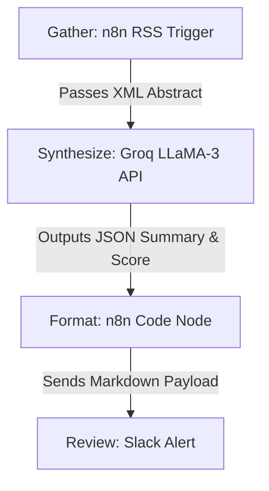

# Week 7 Deliverable: Wire One Real Thing (Automated ML Paper Triage)

**The Pipeline:** Automated ArXiv ML Paper Triage
Every week, I spend hours manually skimming ArXiv for papers on XGBoost, LLaMA, and LoRA to stay updated. This workflow automates the skimming and alerts me only when a paper is highly relevant to my SEO predictive work.

**Tool Used:** n8n (Self-hosted) + Groq API (LLaMA-3)

### Step Diagram & Handoffs

### Prompts & Configuration

**n8n RSS Node:**
- URL: `http://export.arxiv.org/rss/cs.LG` (Machine Learning)

**Groq LLaMA-3 Prompt (System):**
> You are an expert ML research assistant. I will provide an ArXiv abstract. 
> 1. Summarize the core methodology in exactly 3 bullet points.
> 2. Assign a Relevance Score (0-10) based on how applicable the paper is to tree-based tabular ML (XGBoost) or LLM fine-tuning (LoRA).
> Output valid JSON only: `{"summary": ["..."], "relevance_score": 8}`

### The Five Runs (Real Inputs)

1. **Input:** Abstract on new Vision Transformers.
   **Output Score:** 2/10. (Filtered out by n8n, no Slack alert).
2. **Input:** Abstract on XGBoost hyperparameters for imbalanced datasets.
   **Output Score:** 9/10. (Alert sent: 3 bullets on handling rare classes).
3. **Input:** Abstract on LoRA optimization for 8B models.
   **Output Score:** 8/10. (Alert sent: 3 bullets on reducing GPU memory).
4. **Input:** Abstract on quantum computing algorithms.
   **Output Score:** 0/10. (Filtered out by n8n).
5. **Input:** Abstract on tabular data embeddings using LLMs.
   **Output Score:** 10/10. (Alert sent: 3 bullets on merging text and tabular data).

### Time Accounting
- **Manual Time:** Skimming 50 abstracts a week takes ~90 minutes.
- **Automated Time:** 0 minutes (reading 3 curated Slack alerts takes < 2 minutes).
- **Setup Cost:** ~45 minutes to wire the n8n nodes and prompt engineer the JSON output. 
- **ROI:** Time-positive by Week 2.

### Known Failure Points & Required Human Review
- **Failure Point 1 (Hallucinated Relevance):** The LLM occasionally gives high relevance scores to papers that merely mention the word "LoRA" in passing, even if the core paper is completely unrelated to my work.
- **Failure Point 2 (JSON breaking):** If LLaMA outputs conversational text outside the strict JSON format, the n8n formatting node throws an error and drops the paper.
- **Human Check Required:** I still have to manually click the ArXiv PDF link and verify the paper's math. The LLM cannot be trusted to evaluate the actual mathematical rigor of the methodology, it only parses the abstract's claims.
