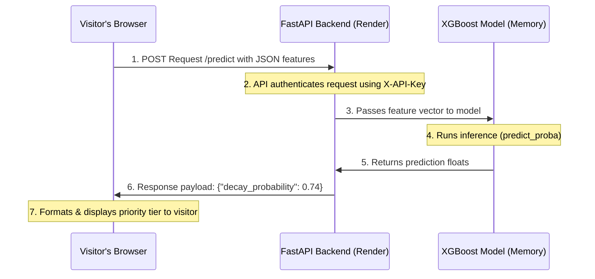

# Week 8 Deliverable: Wire One Real Thing

**My Dynamic Feature:** A Live Interactive ML Inference Tool
Instead of a simple static email contact form, my portfolio integrates a live, working prediction form that queries my deployed FastAPI backend running my XGBoost model in real-time.

---

## The Plain-Words Explainer

### 1. What is a "Backend"?
A static website (like the frontend page hosted on GitHub Pages) is just a document. It can display text, play animations, or link to other files, but it has no memory and cannot do complex mathematics. 

A backend is the "brain" running on a remote server that stays awake to perform calculations, read from databases, or execute heavy Python code (like running my machine learning models) that the static webpage is incapable of doing on its own.

### 2. How the Feature Works
In my portfolio, there is an interactive form where a visitor can input a webpage's metrics (such as word count, traffic history, and link changes). 

When the visitor clicks "Run Prediction", the browser collects these inputs, packages them up, and sends them across the internet to my FastAPI backend. The backend feeds these values into the trained XGBoost model, receives the decay probability, and sends that calculation back to the browser to display in the UI.

### 3. The Data Flow (Step-by-Step)

1. **User Action:** The visitor fills out the form and hits submit. JavaScript in `app.js` runs a `fetch()` command, sending an HTTPS POST request containing the metrics in JSON format.
2. **Security Gate:** The request lands on my Render server, where my FastAPI router intercepts it and checks the headers for a valid `X-API-Key`.
3. **Model Prediction:** Once authenticated, the server loads the features into a NumPy array and feeds it directly to the serialized XGBoost model residing in the server's memory.
4. **Data Return:** The model runs a fast mathematical calculation and outputs the decay probability float.
5. **Display:** The server packages the probability into a JSON response, sends it back over HTTPS, and the frontend updates the page to display the risk assessment.

All of this runs on the free hosting tiers of GitHub Pages (frontend) and Render (backend).
