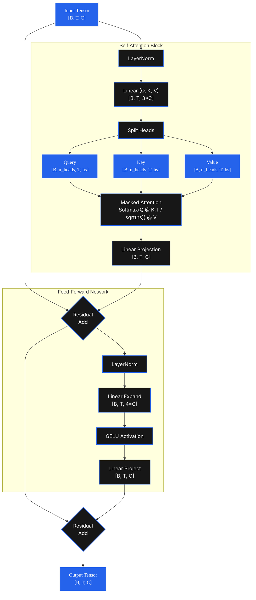

# NanoGPT Transformer Block Architecture

*Note: Take a screenshot of this rendered diagram. This satisfies the "Real Capture" requirement for your portfolio's Project Architecture image.*

```mermaid
graph TD
    %% Styling based on your custom Identity Kit
    classDef tensor fill:#2563EB,stroke:#FAFAFA,stroke-width:2px,color:#FAFAFA,font-family:JetBrains Mono;
    classDef op fill:#171717,stroke:#2563EB,stroke-width:2px,color:#FAFAFA,font-family:Inter;
    classDef structural fill:none,stroke:none,color:#FAFAFA,font-family:JetBrains Mono,font-size:16px,font-weight:bold;

    Input["Input Tensor<br>[B, T, C]"]:::tensor --> LN1["LayerNorm"]:::op
    
    %% Self Attention Block
    subgraph Self-Attention Block
        LN1 --> QKV["Linear (Q, K, V)<br>[B, T, 3*C]"]:::op
        QKV --> Split["Split Heads"]:::op
        Split --> Q["Query<br>[B, n_heads, T, hs]"]:::tensor
        Split --> K["Key<br>[B, n_heads, T, hs]"]:::tensor
        Split --> V["Value<br>[B, n_heads, T, hs]"]:::tensor
        
        Q --> Attention["Masked Attention<br>Softmax(Q @ K.T / sqrt(hs)) @ V"]:::op
        K --> Attention
        V --> Attention
        
        Attention --> AttnProj["Linear Projection<br>[B, T, C]"]:::op
    end
    
    Input --> Add1{"Residual<br>Add"}:::op
    AttnProj --> Add1
    
    %% Feed Forward Block
    subgraph Feed-Forward Network
        Add1 --> LN2["LayerNorm"]:::op
        LN2 --> FFN1["Linear Expand<br>[B, T, 4*C]"]:::op
        FFN1 --> GELU["GELU Activation"]:::op
        GELU --> FFN2["Linear Project<br>[B, T, C]"]:::op
    end
    
    Add1 --> Add2{"Residual<br>Add"}:::op
    FFN2 --> Add2
    
    Add2 --> Output["Output Tensor<br>[B, T, C]"]:::tensor
```
