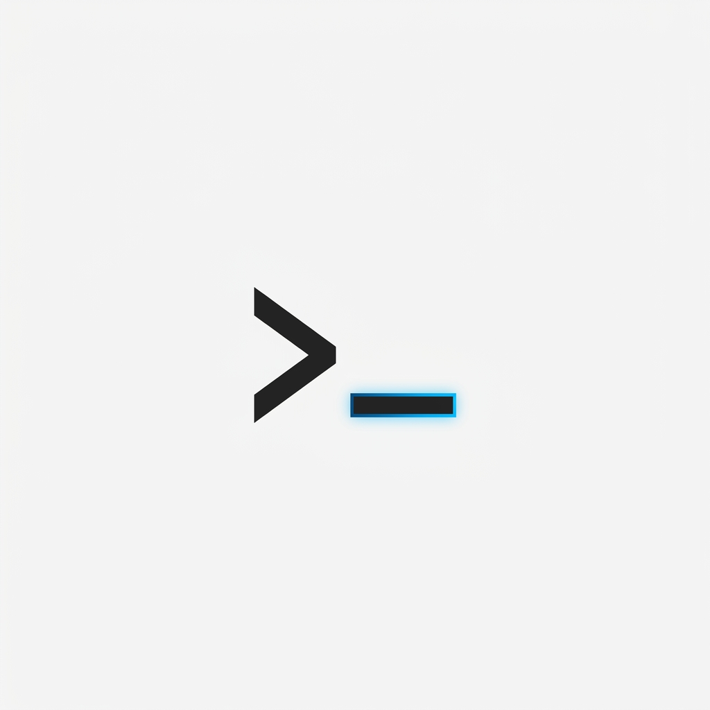

# Identity Kit

## Logo / Favicon

## Typography
- **Heading Font:** `JetBrains Mono` (Geometric, monospaced, terminal aesthetic)
- **Body Font:** `Inter` (Highly legible, crisp, neutral)

## Color Palette
- **Background:** `#FAFAFA` (Near-white)
- **Text:** `#171717` (Near-black)
- **Accent:** `#2563EB` (Technical Electric Blue)

## Style Note
**Mood:** Direct, unapologetically technical, precise, zero fluff. 
The visual language mimics an IDE environment—clean contrasts and monospaced anchors—designed exclusively to frame the code and data without competing for attention.
