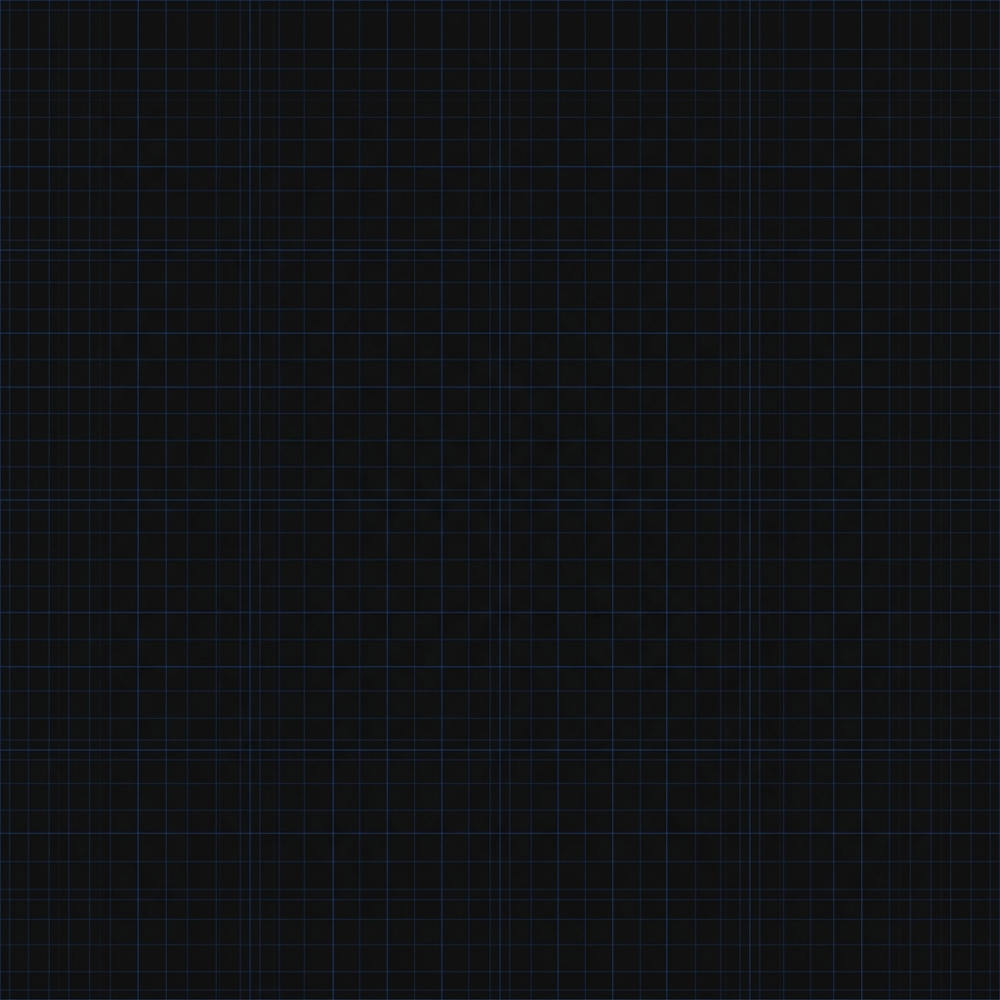

# Image Curation Log

## 1. The Portfolio Image List
To build out a highly technical portfolio, the visual content map requires exactly four types of images:
1. **Hero Texture:** Background connective tissue to set the IDE environment aesthetic.
2. **Project Architecture:** Visual diagrams of the ML pipelines.
3. **Code Snippets:** Core logic and tensor shape verifications.
4. **Headshot:** The "About Me" author photo.

## 2. Real Captures vs. AI Generation
**Real Captures:**
- **Project Architecture & Code Snippets:** I will strictly use *real screenshots* of my VS Code environment and actual Mermaid.js diagrams. AI stand-ins for code look fake and instantly destroy credibility. The code must be legible and authentic.
- **Headshot:** A real, unedited photo of myself. No AI-generated avatars.

**AI Generation (Connective Tissue):**
- **Hero Texture:** Generated to match the exact hex codes of the Identity Kit (`#171717` background, `#2563EB` accent).

## 3. The Rejection Note (Discernment)
**Rejected Prompt:** *"A glowing, high-tech cyberpunk matrix code background, lots of neon blue data streams."*
**Why I rejected it:** The resulting image was incredibly cliché and visually noisy. A portfolio's background texture should frame the work, not compete with it. The glowing neon data streams made it impossible to read dark text and looked like a cheap movie trope rather than a serious ML engineering environment. I ruthlessly scrapped it in favor of the flat, subtle geometric grid (shown above), which stays quiet and lets the actual code screenshots be the loudest thing on the page.
